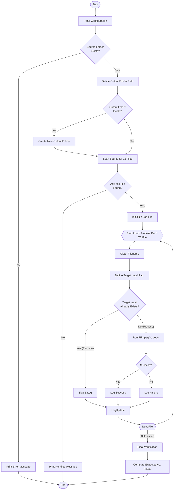

# Batch TS to MP4 Converter

A robust Python script to batch convert **standalone** `.ts` video files to `.mp4` format using FFmpeg. It performs a lossless stream copy, ensuring zero quality loss and blazing fast speed.

> [!CAUTION]
> **CRITICAL NOTE / 关键提示**
>
> This script is designed for **1-to-1 conversion** (1 TS file = 1 complete video).
> **It is NOT designed to merge/join multiple TS fragments (segments) into a single video.**
>
> 本脚本仅适用于 **1对1转换**（即：一个TS文件就是一个完整的视频）。
> **绝不适用** 于将多个 TS 切片（如 HLS/m3u8 产生的碎片）合并成一个视频。


## ✨ Features
* **🚀 1-to-1 Conversion**: Converts each individual `.ts` file into a separate `.mp4` file. Perfect for standalone recordings, not for HLS segments.
* **⚡ Lossless & Fast**: Uses FFmpeg's stream copy (`-c copy`) mode. Conversion takes only seconds per video with zero quality loss.
* **🧹 Filename Cleaning**: Automatically sanitizes filenames by removing illegal characters and spaces to prevent errors.
* **⏭️ Resume Capability**: Automatically skips files that have already been converted.
* **📊 Verification Report**: Generates a final comparison report to ensure every source file has a corresponding output file.
* **📝 Logging**: Saves a detailed `.txt` log file in the output folder.

## 🛠️ Requirements
1.  **Python 3.x**
2.  **FFmpeg**: Must be installed and added to your system's PATH.

## 🚀 Usage
1.  **Clone the repository**:
    ```bash
    git clone [https://github.com/YOUR_USERNAME/YOUR_REPO_NAME.git](https://github.com/YOUR_USERNAME/YOUR_REPO_NAME.git)
    ```
2.  **Configure Paths**:
    Open the python script and modify the `INPUT_FOLDER_PATH` variable to point to your `.ts` folder.
    ```python
    INPUT_FOLDER_PATH = r"C:\path\to\your\videos"
    ```
3.  **Run the script**:
    ```bash
    python ts2mp4_public.py
    ```

## 📂 Output
The script will automatically create a new folder (e.g., `Converted_Videos`) next to your source folder to store the mp4 files.





---

# TS转MP4批量转换工具 (中文说明)

这是一个基于 Python 和 FFmpeg 的高效脚本，用于将**独立**的 `.ts` 视频文件批量无损转换为 `.mp4` 格式。

> ⚠️ **重要提示**：本脚本仅适用于**“1对1转换”**（即：一个TS文件就是一个完整的视频）。**不适用**于将多个 TS 切片（如 HLS/m3u8 产生的碎片）合并成一个视频。

## ✨ 主要功能
* **🚀 1对1 独立转换**: 每一个 `.ts` 文件都会被转换为一个独立的 `.mp4` 文件。
* **⚡ 无损极速转换**: 使用 FFmpeg 的流复制模式 (`-c copy`)，无需重新编码，几秒钟完成转换，画质 100% 无损。
* **🧹 文件名清洗**: 自动清理文件名中的非法字符（如 `?`, `*`）和多余空格，防止报错。
* **⏭️ 断点续传**: 自动检测并跳过已转换的文件，支持中途停止后继续运行。
* **📊 最终核对**: 运行结束后生成对比报告，确保源文件和新文件一一对应，无遗漏。
* **📝 日志记录**: 自动在输出文件夹生成详细的运行日志 `.txt`。

## 🛠️ 环境要求
1.  **Python 3.x**
2.  **FFmpeg**: 必须安装 FFmpeg 并将其添加到系统的环境变量中。

## 🚀 使用方法
1.  **下载代码**:
    ```bash
    git clone [https://github.com/你的用户名/仓库名.git](https://github.com/你的用户名/仓库名.git)
    ```
2.  **修改路径**:
    用编辑器打开 Python 脚本，找到 `INPUT_FOLDER_PATH` 变量，修改为你存放 `.ts` 视频的文件夹路径。
    ```python
    INPUT_FOLDER_PATH = r"C:\你的\视频\文件夹"
    ```
3.  **运行脚本**:
    ```bash
    python ts2mp4_public.py
    ```

## 📂 输出结果
脚本会在你的源文件夹旁边自动创建一个新的文件夹（例如 `Converted_Videos`），所有转换好的 mp4 视频都会存放在那里，不会污染源文件夹。


---

## 📄 License
MIT License